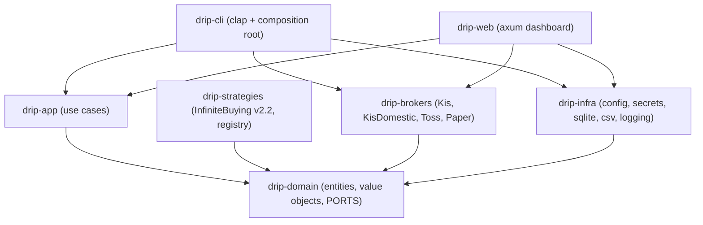

# Architecture

drip is a **hexagonal (ports & adapters)** Rust workspace. The domain defines abstract
ports; outer crates implement them. Dependencies always point inward, enforced physically
by crate boundaries.

## System overview

Every arrow points toward `drip-domain`. The domain depends on nothing in the workspace,
so it has no idea HTTP, sqlite, or clap exist. The CLI and the web dashboard are the
driving adapters (composition roots) — the only crates that know every concrete adapter.

## Crates

| Crate | Responsibility | Key types |
|---|---|---|
| `drip-domain` | Pure model + ports. No I/O, no runtime. | `Money`, `Price`, `Shares`, `Position`, `Holding`, `OrderIntent`, `settle()`, `risk::vet()`, and the port traits (incl. `OrderGateway`, `OrderJournal`). |
| `drip-strategies` | Built-in strategies + registry (OCP seam). | `InfiniteBuying`, `StrategyRegistry`. |
| `drip-brokers` | Broker adapters; KIS requests are throttled to the broker's per-second rate limit and its OAuth token is cached on disk across processes (ADR-11). | `KisBroker` (US overseas), `KisDomesticBroker` (KRX), `TossBroker`, `PaperBroker`. |
| `drip-app` | Use cases orchestrating ports (shared by CLI + web). | `Backtest`, `BacktestReport`, `account_snapshot`, `dry_run`, `run_backtest`, `place_orders`, `reconcile`, `TickView`. |
| `drip-infra` | Filesystem/sqlite/logging adapters. | `AppConfig`, `FileSecretStore`, `SqliteStateRepository`, `CsvMarketData`. |
| `drip-cli` | CLI + composition root (binary `drip`). | `main`, command handlers. |
| `drip-web` | Read-only axum dashboard (`drip web`); a driving adapter over the use cases. | `serve`, HTTP handlers. |

## Ports (domain abstractions)

- **`Strategy`** — `decide(&DailyContext) -> Vec<OrderIntent>` plus `triggers() -> Vec<Trigger>`
  (default: a daily `Schedule`, which the engine wakes it on). Pure and deterministic; the
  primary extension point.
- **Broker ports, segregated (ISP):** `BrokerInfo` (id + capabilities), `Quotes`,
  `AccountQuery` (holdings, balance, and `fills_since` execution history for reconciliation),
  `OrderGateway`. An adapter implements only what it supports — `KisBroker` (M2.1),
  `KisDomesticBroker` (#22), and `PaperBroker` implement `OrderGateway`; `TossBroker` does not.
- **`OrderJournal`** — at-most-once idempotency ledger for placed orders (sqlite).
- **`MarketDataSource`**, **`StateRepository`**, **`SecretStore`** — infra ports.
- **Not ports — pure domain logic** (concrete, single-implementation, like `settle`/`risk`):
  `calendar` (market-aware trading *date* — `trading_date(market, now)`: KST for KRX, US Eastern
  for US equities; plus the NYSE holiday set, which stays US-only — ADR-9/ADR-12) and `schedule`
  (`next_fire`/`is_due` over the US trading calendar).

## Key design decisions (ADR-style)

### ADR-1: Money is an exact `Decimal`, never `f64`
**Context:** Average-price and fill math compounds across an "infinite buying" cycle.
**Decision:** `Money`/`Price`/`Percent` wrap `rust_decimal::Decimal`; there is no `f64`
constructor. **Rationale:** float rounding errors are unacceptable on real orders. Backtest
*statistics* (CAGR/MDD) use `f64` — those are ratios, not money.

### ADR-2: Read-only live integration is enforced by the type system
**Context:** M1 must talk to live brokers but must not place live orders.
**Decision:** Split the broker surface into `Quotes` / `AccountQuery` / `OrderGateway`
(Interface Segregation). KIS and Toss implement the first two; **only `PaperBroker`
implements `OrderGateway`.** **Rationale:** there is literally no code path to place a live
order — the compiler guarantees it, not a runtime flag.
**Superseded for KIS by ADR-7 (M2.1):** KIS now implements `OrderGateway`; the guarantee moved
from the type system to runtime guards. Toss still does not implement it.

### ADR-3: Capability-based broker abstraction with graceful degradation
**Context:** Brokers differ — KIS has WebSocket + paper trading; Toss (today) has neither.
**Decision:** `Broker::capabilities()` reports `realtime_quotes`, `paper_account`,
`order_placement`, `overseas`. The engine reads them and degrades (poll instead of stream).
**Rationale:** adding/removing a capability is a new trait impl, never a core change (OCP).

### ADR-4: One settlement rule, shared by backtest and paper trading
**Context:** A backtest and the paper broker must agree exactly on what fills.
**Decision:** `drip_domain::settle(intent, bar) -> Option<Fill>` is the single source of
truth, used by both `Backtest` and `PaperBroker`. **Rationale:** DRY; no drift between
"what the backtest said" and "what paper trading does".

### ADR-5: `Position` (strategy ledger) ≠ `Holding` (broker truth)
**Context:** A broker reports shares + average price; it does not know our seed/splits/cycle.
**Decision:** `AccountQuery` returns `Holding` (ticker, shares, avg); `Position` (seed,
splits, T, cycle) is drip's own state in `StateRepository`. **Rationale:** SRP; the engine
reconciles broker holdings against its local ledger.

### ADR-6: Single binary over runtime dependencies
**Decision:** `reqwest` with `rustls-tls` (no OpenSSL) and `rusqlite` `bundled` (sqlite
compiled in). **Rationale:** `curl | sh`-style install with zero system dependencies.

### ADR-7: Going live is guarded at runtime, not by types (M2.1)
**Context:** M2.1 makes KIS place real orders, which removes ADR-2's type-level block.
**Decision:** `KisBroker` implements `OrderGateway`; all placement funnels through the single
use case `drip_app::place_orders`, which enforces, in order: (1) a real-account gate (refuses a
non-`paper_account` broker unless `allow_real`/`--live`); (2) a pure pre-trade
`drip_domain::risk::vet` on every intent, aborting the whole tick on any violation; (3)
at-most-once placement — reserve an `OrderJournal` client key *before* sending, so a crash or a
same-day re-run never double-buys; (4) dry-run by default. `TossBroker` stays read-only (no 모의
sandbox). **Rationale:** going live is inherently a runtime capability; concentrating the guards
in one use case means every driving adapter (CLI, web, future scheduler) inherits them, and the
type system still blocks Toss.

### ADR-8: Fill reconciliation advances the ledger via a per-day watermark (M2.2)
**Context:** `drip tick` placed orders but never folded executions back into the `Position`, so
the tranche counter `T` did not auto-advance between days.
**Decision:** `AccountQuery::fills_since` is implemented for KIS (overseas `inquire-ccnl`); a
pure `Position::reconcile(fills, today)` applies only fills on **completed days not yet
reconciled** (`reconciled_through < date < today`), then advances the `reconciled_through`
watermark stored on the `Position`. `place_orders` runs it *before* deciding (persisting only on
`--execute`; a preview reconciles in-memory so it never mutates stored state); `drip reconcile`
exposes it standalone. **Rationale:** the watermark is idempotent by construction (a re-run, or
a day's not-yet-final fills, never double-counts) and needs no per-execution id from the broker
— exact for drip's day orders (LOC / day-limit), where a completed day's fills are final. A
per-order/partial-fill ledger is deferred to streaming (intraday) strategies. Reconcile is
read-only at the broker, so it runs without `--live`; folding it into `place_orders` means every
driving adapter inherits a fresh ledger — no placement on a stale `T`. Under-counting a fill
would make the strategy over-buy, so every drop path (truncated pages, a malformed row) is an
explicit error, never a silent skip.

### ADR-9: The trading date is the US Eastern session date, not UTC (M2.3)
**Context:** The at-most-once order key and the reconcile boundary keyed on the UTC date. A US
(Eastern) session runs into the next UTC day, so an after-hours rerun got a *different* key and
risked a double-place — the one thing the journal exists to prevent.
**Decision:** A pure `drip_domain::calendar` resolves the US Eastern date (DST-aware, by
comparing the UTC instant against the spring/fall transition instants — no date-extraction
ambiguity) and the NYSE holiday set. The CLI and the scheduler key the trading date off it; KIS
reports overseas `ord_dt` in exchange-local (Eastern) time, so the reconcile boundary now matches
the fills it compares against. **Rationale:** a market calendar is a property of the *market*, not
of any broker, so it belongs in the domain (like `settle`/`risk`), where it is pure and
exhaustively unit-tested offline — and a single source of truth shared by every adapter.
**Extended by ADR-12 (#22):** the date is now market-aware — `calendar::trading_date(market, now)`
resolves the KST session date for KRX (UTC+9, no DST) and the US-Eastern date for US equities (the
original branch above). The NYSE holiday set and the scheduler stay US-only; KRX holidays +
domestic scheduling are P4.

### ADR-10: The scheduler engine lives in the CLI; the scheduling logic lives in the domain (M2.3)
**Context:** `drip tick` is a one-shot; M2 also needs an always-on daemon that fires positions on
a cadence (`drip run`).
**Decision:** The *decisions* are pure domain: `Strategy::triggers()` declares when to fire
(default: a daily `Schedule`), and `calendar`/`schedule` compute `next_fire`/`is_due` over the
trading calendar. The *loop* — sleep until the next fire, fire due jobs, stop on a signal — is a
thin async module in `drip-cli` (a driving adapter), where `tokio::main` and signal handling
already live, so `drip-app` stays free of `tokio::time`/`signal`. Each fire goes through the
existing `place_orders` (never a second placement path). **Rationale:** keeping the brains pure
makes them testable with a fixed clock and reusable by a future `drip-engine` crate when M3
streaming sources arrive; the daemon's safety (per-position error isolation, trading-window
catch-up backed by the idempotent journal, graceful shutdown) is glue around already-proven
guards. A market calendar gives every `OnTick`/`OnPriceCross` strategy a future seam without a
core change.

### ADR-11: The KIS OAuth token is cached on disk, with the cache path injected (M2.3+)
**Context:** Each `drip` CLI command is a separate process, so an in-memory token cache re-issues
a KIS OAuth token every command. KIS allows ~1 token/min per app key, so back-to-back commands —
and `drip run` with multiple KIS positions — got `403` on the token endpoint.
**Decision:** `TokenCache` is two-tier — L1 in-memory plus an optional L2 on-disk `TokenStore`
(a `0600` JSON file under the drip home, keyed by environment + app-key hash). A token is valid
~24h, so it is issued at most once per day across processes. The disk record stores an
**absolute** expiry (the in-memory `Instant` is process-monotonic and unserializable) and `load()`
guards the expiry before the unsigned cast, so a stale file is a miss, not a wrapped huge TTL. The
cache **directory is injected from the composition root** (`connect(.., token_cache_dir)`; the CLI
and web pass the drip home, tests pass `None`), so `drip-brokers` gains no dependency on
`drip-infra`. **Rationale:** disk is the only shared state between one-shot processes; injecting
the path keeps filesystem-layout knowledge in the composition root and the adapter testable with a
temp dir. Multi-position `drip run` works for free — positions fire sequentially, so the first
writes the token and the rest read it. The per-*second* `RateLimiter` shares its last-request
timestamp on disk the same way (#17), so back-to-back commands coordinate across processes too;
only truly-parallel launches race the shared file (best-effort, benign on 모의).

### ADR-12: Domestic KRX is a separate adapter sharing the KIS session (#22)
**Context:** The 모의 account is KRW-funded but holds zero USD, so overseas (US) placement cannot
execute there — the live path on 모의 is the Korean (KRX) market. KRX differs from the US overseas
API in endpoints, order types, price ticks, and session timezone.
**Decision:** A separate `KisDomesticBroker` implements `Quotes`/`AccountQuery`/`OrderGateway`
against the domestic KIS endpoints, reusing the same `KisConfig` / OAuth token / rate limiter as
the overseas `KisBroker`. At the domain level both share `BrokerId::Kis` (there is no
`KisDomestic` variant); the position's **broker string** (`"kis-domestic"`) is what routes
`connect()` to the domestic adapter and `position_market()` to KST — the persisted `BrokerId`
never drives routing (so `drip status` showing `kis` for a domestic position is cosmetic, by
design). Domestic orders are placed as **지정가 (limit)** at the leg's limit price, rounded to the
KRX ETF tick (the 모의 account rejects LOC; overseas uses LOC `ORD_DVSN 34`). Reconcile reads
`inquire-daily-ccld`, whose rows carry no per-fill price, so the price is total executed amount ÷
executed qty. The trading date is the **KST** session date (UTC+9, no DST — extending ADR-9), so
an intraday rerun on KRX never double-places. **A real domestic account is still fenced in
`place()`** (a deliberate go-live, taken only after the 모의 cross-day reconcile is confirmed
live), and **`drip run` skips domestic** (its schedule + holiday calendar are US-only — domestic
scheduling is P4).
**Rationale:** a thin second adapter reuses the proven KIS session and guards (`place_orders`,
journal, risk-vet) while isolating the market-specific surface; keeping `BrokerId` shared avoids a
state migration, with the config string carrying the overseas/domestic distinction where routing
actually happens.

## Data flow: a backtest

1. CLI loads the position config and builds the strategy via `StrategyRegistry`.
2. `CsvMarketData` reads daily bars.
3. `Backtest::run` iterates bars: `strategy.decide` → `settle` each intent against the bar →
   `Position::apply_fill` → detect cycle completion → mark to market.
4. Returns a `BacktestReport` (equity curve, CAGR, MDD, cycles).

## Data flow: `drip tick` (live order placement)

1. CLI resolves the position + KIS broker (`connect`) and gets its `OrderGateway` via
   `as_order_gateway()` (Toss → `None` → a clean error).
2. `place_orders` (drip-app) gates a real account behind `--live`, then **reconciles** settled
   fills into the ledger (see below), loads the persisted `Position`, fetches a quote, and runs
   `strategy.decide` on the now-current state.
3. Every intent is `risk::vet`-ed against the position's anchor; one failure aborts the tick.
4. For each intent (only when `--execute`): reserve an `OrderJournal` key → `gateway.place` →
   record the broker order id. Re-running the same day skips reserved keys (at-most-once).
5. The **overseas** KIS adapter maps `LimitOnClose` → `ORD_DVSN 34` (real) or `00` (모의, which
   rejects LOC); prices are rounded to the US $0.01 tick before sending. The **domestic** adapter
   instead places 지정가 (limit) at each leg's price, rounded to the KRX ETF tick (ADR-12).

## Data flow: fill reconciliation (`drip reconcile`, also the first step of `tick`)

1. `reconcile` (drip-app) loads the `Position` and calls `AccountQuery::fills_since(ticker,
   since)`, where `since` is the position's `reconciled_through` watermark (or a 90-day floor on
   the first run).
2. The KIS adapter queries execution history — overseas `inquire-ccnl` or domestic
   `inquire-daily-ccld` (#22), paginated — mapping each filled row to a `Fill` in chronological
   order (domestic rows carry no per-fill price, so it is total executed amount ÷ qty).
3. `Position::reconcile` applies only fills dated **after the watermark and before today**
   (completed days), grouped per day through the shared `apply_day` rule — advancing `T`,
   banking completed cycles, and moving the watermark. It is idempotent: a re-run applies
   nothing new.
4. The advanced `Position` is persisted **only when committing** — `drip reconcile` and
   `drip tick --execute` save it; a `tick` preview reconciles in-memory and decides on it
   without writing (like `dry-run`). A broker without execution history (Toss) yields a note
   and leaves the ledger untouched, rather than failing.

## Data flow: `drip run` (the scheduler daemon)

1. At startup the CLI resolves every configured position to a broker + strategy + seed template,
   skipping any read-only broker (Toss) with a warning. Each strategy's `triggers()` yields a
   `Schedule`.
2. The engine loop (in `drip-cli`) reads the clock and, for every schedule that `is_due` (today
   is an Eastern trading day and the time is within `[fire, 16:00)`), fires that position through
   `place_orders` — the same guarded path as `drip tick` (reconcile → decide → risk-vet →
   at-most-once placement). A fire's error is logged and isolated; the loop continues.
3. It then computes the soonest `next_fire` across all schedules (skipping weekends and NYSE
   holidays) and sleeps until then — or returns immediately on SIGINT/SIGTERM.
4. Catch-up and restart are safe by construction: firing keys on the Eastern date through the
   `OrderJournal`, so a daemon launched mid-session (or restarted) re-runs the day without
   double-placing, and the trading-window bound keeps it from placing an order that cannot fill
   today.

## Milestone boundaries

- **M1 (done):** domain + 무한매수 v2.2 + Paper + Backtest + read-only KIS/Toss + CLI + a
  read-only web dashboard.
- **M2.1 (done):** live KIS `OrderGateway` + `drip tick` (risk guard, at-most-once journal,
  dry-run/`--live` gating). Toss stays read-only (no 모의 sandbox).
- **M2.2 (done):** fill reconciliation — `drip reconcile` + `AccountQuery::fills_since` (KIS
  `inquire-ccnl`) fold executions into the ledger so `T` auto-advances and cycles bank;
  `drip tick` reconciles before deciding.
- **M2.3 (done):** ET trading-date idempotency (`drip_domain::calendar`, issue #3) + the
  `drip run` scheduler daemon (`Trigger`/`Schedule`, `Strategy::triggers()`, a pure NYSE trading
  calendar, issue #4). `drip tick` stays the one-shot path.
- **Domestic KRX (#22, done):** a `KisDomesticBroker` (`--broker kis-domestic`) — Phase 0
  read-only + Phase 1 placement (지정가 limit at the leg price, rounded to the KRX ETF tick), the
  KST trading date (P1), domestic reconcile via `inquire-daily-ccld` (P2), and 모의 placement
  enabled (P3; `drip fills` inspects raw executions). A real domestic account stays fenced in
  `place()`; `drip run` skips domestic (US-only schedule).
- **M3+ (next):** domestic `drip run` scheduling + a KRX holiday calendar (#22 P4) and a real
  domestic go-live (lift the `place()` fence); WebSocket quotes + realtime triggers
  (`OnTick`/`OnPriceCross`), Rhai user strategies, OS-keychain secrets, rate-limiting,
  notifications. See the [M2 engine sketch](./docs/M2-engine-sketch.md) for the unified
  always-on/scheduled design.
