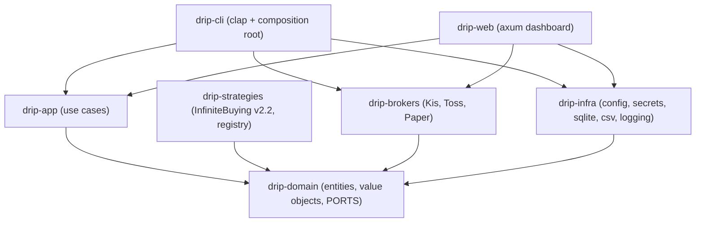

# Architecture

drip is a **hexagonal (ports & adapters)** Rust workspace. The domain defines abstract
ports; outer crates implement them. Dependencies always point inward, enforced physically
by crate boundaries.

## System overview

Every arrow points toward `drip-domain`. The domain depends on nothing in the workspace,
so it has no idea HTTP, sqlite, or clap exist. The CLI and the web dashboard are the
driving adapters (composition roots) — the only crates that know every concrete adapter.

## Crates

| Crate | Responsibility | Key types |
|---|---|---|
| `drip-domain` | Pure model + ports. No I/O, no runtime. | `Money`, `Price`, `Shares`, `Position`, `Holding`, `OrderIntent`, `settle()`, `risk::vet()`, and the port traits (incl. `OrderGateway`, `OrderJournal`). |
| `drip-strategies` | Built-in strategies + registry (OCP seam). | `InfiniteBuying`, `StrategyRegistry`. |
| `drip-brokers` | Broker adapters. | `KisBroker`, `TossBroker`, `PaperBroker`. |
| `drip-app` | Use cases orchestrating ports (shared by CLI + web). | `Backtest`, `BacktestReport`, `account_snapshot`, `dry_run`, `run_backtest`, `place_orders`, `TickView`. |
| `drip-infra` | Filesystem/sqlite/logging adapters. | `AppConfig`, `FileSecretStore`, `SqliteStateRepository`, `CsvMarketData`. |
| `drip-cli` | CLI + composition root (binary `drip`). | `main`, command handlers. |
| `drip-web` | Read-only axum dashboard (`drip web`); a driving adapter over the use cases. | `serve`, HTTP handlers. |

## Ports (domain abstractions)

- **`Strategy`** — `decide(&DailyContext) -> Vec<OrderIntent>`. Pure and deterministic; the
  primary extension point.
- **Broker ports, segregated (ISP):** `BrokerInfo` (id + capabilities), `Quotes`,
  `AccountQuery`, `OrderGateway`. An adapter implements only what it supports — `KisBroker`
  and `PaperBroker` implement `OrderGateway` (M2.1); `TossBroker` does not.
- **`OrderJournal`** — at-most-once idempotency ledger for placed orders (sqlite).
- **`MarketDataSource`**, **`StateRepository`**, **`SecretStore`** — infra ports.

## Key design decisions (ADR-style)

### ADR-1: Money is an exact `Decimal`, never `f64`
**Context:** Average-price and fill math compounds across an "infinite buying" cycle.
**Decision:** `Money`/`Price`/`Percent` wrap `rust_decimal::Decimal`; there is no `f64`
constructor. **Rationale:** float rounding errors are unacceptable on real orders. Backtest
*statistics* (CAGR/MDD) use `f64` — those are ratios, not money.

### ADR-2: Read-only live integration is enforced by the type system
**Context:** M1 must talk to live brokers but must not place live orders.
**Decision:** Split the broker surface into `Quotes` / `AccountQuery` / `OrderGateway`
(Interface Segregation). KIS and Toss implement the first two; **only `PaperBroker`
implements `OrderGateway`.** **Rationale:** there is literally no code path to place a live
order — the compiler guarantees it, not a runtime flag.
**Superseded for KIS by ADR-7 (M2.1):** KIS now implements `OrderGateway`; the guarantee moved
from the type system to runtime guards. Toss still does not implement it.

### ADR-3: Capability-based broker abstraction with graceful degradation
**Context:** Brokers differ — KIS has WebSocket + paper trading; Toss (today) has neither.
**Decision:** `Broker::capabilities()` reports `realtime_quotes`, `paper_account`,
`order_placement`, `overseas`. The engine reads them and degrades (poll instead of stream).
**Rationale:** adding/removing a capability is a new trait impl, never a core change (OCP).

### ADR-4: One settlement rule, shared by backtest and paper trading
**Context:** A backtest and the paper broker must agree exactly on what fills.
**Decision:** `drip_domain::settle(intent, bar) -> Option<Fill>` is the single source of
truth, used by both `Backtest` and `PaperBroker`. **Rationale:** DRY; no drift between
"what the backtest said" and "what paper trading does".

### ADR-5: `Position` (strategy ledger) ≠ `Holding` (broker truth)
**Context:** A broker reports shares + average price; it does not know our seed/splits/cycle.
**Decision:** `AccountQuery` returns `Holding` (ticker, shares, avg); `Position` (seed,
splits, T, cycle) is drip's own state in `StateRepository`. **Rationale:** SRP; the engine
reconciles broker holdings against its local ledger.

### ADR-6: Single binary over runtime dependencies
**Decision:** `reqwest` with `rustls-tls` (no OpenSSL) and `rusqlite` `bundled` (sqlite
compiled in). **Rationale:** `curl | sh`-style install with zero system dependencies.

### ADR-7: Going live is guarded at runtime, not by types (M2.1)
**Context:** M2.1 makes KIS place real orders, which removes ADR-2's type-level block.
**Decision:** `KisBroker` implements `OrderGateway`; all placement funnels through the single
use case `drip_app::place_orders`, which enforces, in order: (1) a real-account gate (refuses a
non-`paper_account` broker unless `allow_real`/`--live`); (2) a pure pre-trade
`drip_domain::risk::vet` on every intent, aborting the whole tick on any violation; (3)
at-most-once placement — reserve an `OrderJournal` client key *before* sending, so a crash or a
same-day re-run never double-buys; (4) dry-run by default. `TossBroker` stays read-only (no 모의
sandbox). **Rationale:** going live is inherently a runtime capability; concentrating the guards
in one use case means every driving adapter (CLI, web, future scheduler) inherits them, and the
type system still blocks Toss.

## Data flow: a backtest

1. CLI loads the position config and builds the strategy via `StrategyRegistry`.
2. `CsvMarketData` reads daily bars.
3. `Backtest::run` iterates bars: `strategy.decide` → `settle` each intent against the bar →
   `Position::apply_fill` → detect cycle completion → mark to market.
4. Returns a `BacktestReport` (equity curve, CAGR, MDD, cycles).

## Data flow: `drip tick` (live order placement, M2.1)

1. CLI resolves the position + KIS broker (`connect`) and gets its `OrderGateway` via
   `as_order_gateway()` (Toss → `None` → a clean error).
2. `place_orders` (drip-app) gates a real account behind `--live`, loads the persisted
   `Position`, fetches a quote, and runs `strategy.decide`.
3. Every intent is `risk::vet`-ed against the position's anchor; one failure aborts the tick.
4. For each intent (only when `--execute`): reserve an `OrderJournal` key → `gateway.place` →
   record the broker order id. Re-running the same day skips reserved keys (at-most-once).
5. KIS maps `LimitOnClose` → `ORD_DVSN 34` (real) or `00` (모의, which rejects LOC); prices are
   rounded to the US $0.01 tick before sending.

> M2.1 places orders only — it does **not** yet reconcile fills back into the ledger, so `T`
> does not auto-advance between days. Reconciliation lands in M2.2 (see the engine sketch).

## Milestone boundaries

- **M1 (done):** domain + 무한매수 v2.2 + Paper + Backtest + read-only KIS/Toss + CLI + a
  read-only web dashboard.
- **M2.1 (done):** live KIS `OrderGateway` + `drip tick` (risk guard, at-most-once journal,
  dry-run/`--live` gating). Toss stays read-only (no 모의 sandbox).
- **M2.2+:** fill reconciliation (advance the ledger from executions), the scheduler /
  `drip run` daemon (US open/close), Rhai user strategies, WebSocket quotes, OS-keychain
  secrets, rate-limiting, notifications. See the [M2 engine sketch](./docs/M2-engine-sketch.md)
  for the unified always-on/scheduled design.
